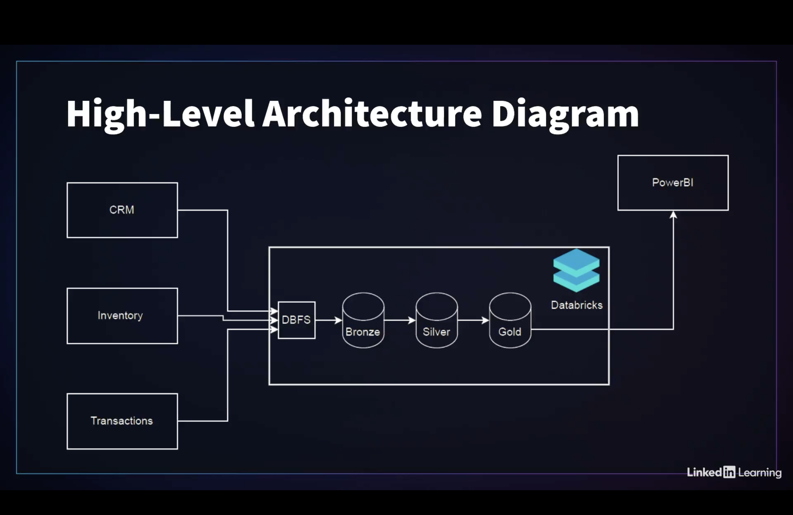

# 🛠️ End-to-End Data Engineering Project with Databricks

This project replicates a real-world data engineering pipeline using **Databricks**, **Delta Lake**, **Spark SQL**, and **Power BI**, based on the LinkedIn Learning course by Deepak Goyal.

## 🔧 Technologies Used

* Databricks (Notebooks)
* Apache Spark & Spark SQL
* Delta Lake (Bronze, Silver, Gold layers)
* Power BI (Dashboard Integration)

## 📊 Architecture Overview

This pipeline uses a 3-layer **Medallion Architecture**:

* **Bronze Layer**: Raw ingestion from CSV, JSON, Parquet
* **Silver Layer**: Data cleaning and joins using Spark SQL
* **Gold Layer**: Aggregated data ready for visualization

## 📁 Project Structure

* `notebooks/`: Databricks notebooks for each layer
* `data_samples/`: Sample datasets used in the pipeline
* `snapshots/`: Screenshots of execution and visualizations

## 📈 Final Output

The processed data was visualized using Power BI, with real-time connections to Delta tables.

## 🎓 Credits

Based on: [LinkedIn Learning Course](https://www.linkedin.com/learning/end-to-end-real-world-data-engineering-project-with-databricks/)

Instructor: [Deepak Goyal](https://www.linkedin.com/in/deepak-goyal-93805a17/)

Certificate: [View Certificate](https://www.linkedin.com/learning/certificates/e1f279d4731ae5caefacfa229b6e899e39eeceba4c4a85c72329336696c73183?trk=share_certificate)

## 📌 Author

Dharmik Kurlawala
Master’s in Computer Science, Cleveland State University
📧 [kurlawaladharmik@gmail.com](mailto:kurlawaladharmik@gmail.com)
